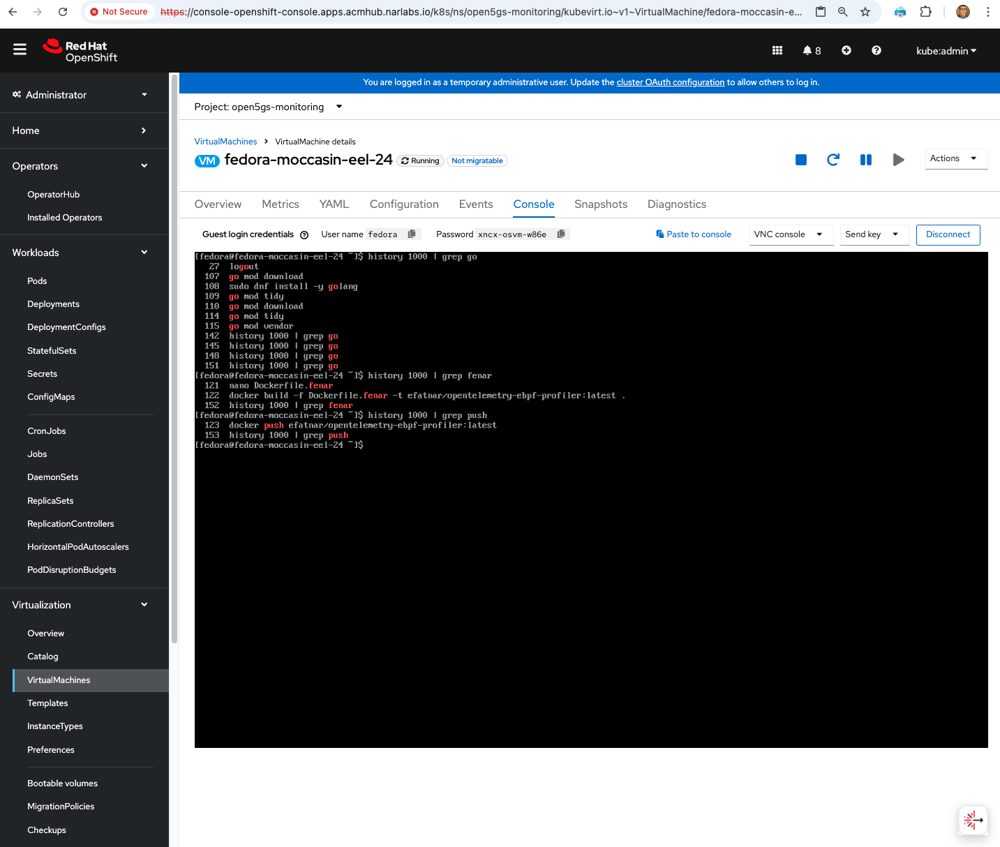

## 🧠 Open5GS Observability Stack with eBPF + OpenTelemetry

This repo provides OpenShift-compatible manifests for lightweight observability of 5G CNFs using [eBPF profiling](https://github.com/open-telemetry/opentelemetry-ebpf-profiler) and OpenTelemetry Collector.

Our 5G Ready2Roll Stack Here: -> https://github.com/open-experiments/sandbox-5g

---

### 📦 Build & Deployment Overview

We built the custom `ebpf-profiler` binary from the upstream [`open-telemetry/opentelemetry-ebpf-profiler`](https://github.com/open-telemetry/opentelemetry-ebpf-profiler) source using a Fedora 24 VM running on **OpenShift Virtualization (OCP Virt)**:

<div align="center">
    
</div>

```bash
# To avoid tls timeouts for go dependency downloads
sudo dnf install -y golang
go mod tidy
go mod vendor
go mod download

# Build and push steps from fedora-moccasin-eel-24
docker build -f Dockerfile.fenar -t efatnar/opentelemetry-ebpf-profiler:latest .
docker push efatnar/opentelemetry-ebpf-profiler:latest
```

The resulting container is now available at:

```txt
docker.io/efatnar/opentelemetry-ebpf-profiler:latest
```

This image is used by the `DaemonSet` to instrument each node in the OpenShift cluster.

---

### 📁 Files in This Repo

| File                               | Description                                                               |
|------------------------------------| ------------------------------------------------------------------------- |
| `ebpfprofiler-daemonset.yaml`      | Deploys the `ebpf-profiler` as a `DaemonSet` with necessary host mounts   |
| `otelcol-collector-deployment.yaml`| Deploys `otelcol` using the OpenTelemetry Operator with OTLP + debug flow |
| `ebpf-profiler-scc.yaml`           | Adds SCC for privileged eBPF workloads under `open5gs-monitoring` NS      |
| `otelcol-collector-otlp-service.yaml` | Service exposing the OpenTelemetry Collector OTLP endpoint              |
| `otelcol-collector-metrics-service.yaml` | Service exposing the OpenTelemetry Collector metrics endpoint        |
| `otel-servicemonitor.yaml`         | ServiceMonitor to scrape metrics from the OpenTelemetry Collector         |
| `minio-deployment.yaml`            | MinIO deployment for object storage (used with Tempo for traces)          |

---

### 🚀 Quickstart

```bash
# Create namespace
oc create namespace open5gs-monitoring

# Apply configuration
oc apply -f ebpf-profiler-scc.yaml
oc apply -f otelcol-collector-deployment.yaml
oc apply -f otelcol-collector-metrics-service.yaml
oc apply -f otel-servicemonitor.yaml
oc apply -f otelcol-collector-otlp-service.yaml
oc apply -f ebpfprofiler-daemonset.yaml
oc apply -f minio-deployment.yaml

# Verify deployment
oc get pods -n open5gs-monitoring
```

---

### Monitoring Flow

The monitoring stack provides comprehensive observability for 5G applications:

1. **Data Collection**: The eBPF profiler DaemonSet runs on each node and collects system performance data using eBPF technology
2. **Data Processing**: Profiling data is sent to the OpenTelemetry Collector via OTLP (port 4317)
3. **Metrics Exposition**: The OpenTelemetry Collector processes and exports metrics to the Prometheus endpoint (port 8889)
4. **Metrics Scraping**: The ServiceMonitor configuration allows Prometheus to discover and scrape these metrics
5. **Visualization**: Metrics can be visualized using Grafana dashboards (installed separately)
6. **Storage**: MinIO provides object storage for trace data when integrated with Tempo

---

### Troubleshooting

If the eBPF profiler fails to connect to the OpenTelemetry collector, check the following:

1. Verify that the OpenTelemetry collector pods are running:
   ```bash
   oc get pods -n open5gs-monitoring -l app.kubernetes.io/component=opentelemetry-collector
   ```

2. Check the service endpoints:
   ```bash
   oc get endpoints -n open5gs-monitoring
   ```

3. Examine the eBPF profiler logs:
   ```bash
   oc logs -n open5gs-monitoring $(oc get pods -n open5gs-monitoring -l app=ebpf-profiler -o name | head -1)
   ```

4. Verify that the ServiceMonitor is configured correctly:
   ```bash
   oc get servicemonitor -n open5gs-monitoring otel-collector -o yaml
   ```

---

### Disclaimer

(1) Red Hat build of OpenTelemetry does not support (yet) performance profiling data sink (pprof), therefore you may (?) consider using pyroscope for better observability profiling. 

```
Error: failed to get config: cannot unmarshal the configuration: 1 error(s) decoding:
* error decoding 'receivers': unknown type: "pprof" for id: "pprof" (valid values: [snmp awsxray azureeventhub datadog flinkmetrics pulsar solace syslog redis signalfx apachespark cloudfoundry httpcheck snowflake couchdb filelog hostmetrics riak windowsperfcounters docker_stats iis opencensus receiver_creator sshcheck k8sobjects namedpipe statsd awscloudwatch awscontainerinsightreceiver azureblob journald kafkametrics nginx prometheus_simple vcenter filestats jaeger mongodb oracledb purefb webhookevent zookeeper cloudflare podman_stats prometheus skywalking memcached postgresql purefa splunk_hec sqlquery windowseventlog sapm azuremonitor chrony googlecloudspanner influxdb mongodbatlas nsxt rabbitmq tcplog nop otlp aerospike awsfirehose jmx wavefront collectd loki zipkin active_directory_ds awsecscontainermetrics expvar bigip fluentforward k8s_events kafka kubeletstats sqlserver udplog otlpjsonfile apache carbon elasticsearch googlecloudpubsub haproxy k8s_cluster mysql])
2025/05/13 22:16:25 collector server run finished with error: failed to get config: cannot unmarshal the configuration: 1 error(s) decoding:
```

(2) MinIO is included in this stack for object storage to be used with Tempo for traces.
